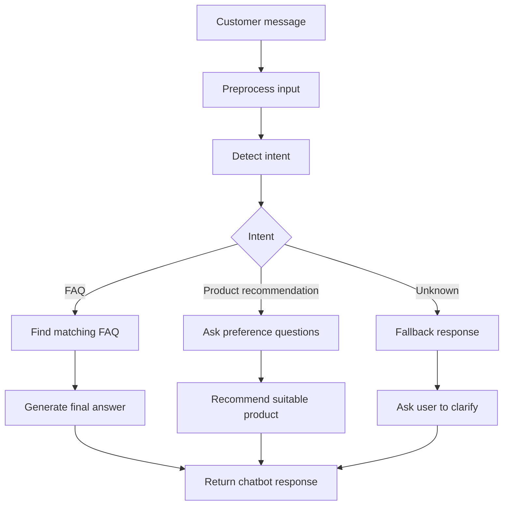

# AI Chatbot Demo

## Overview

This repository is a demo project for an AI-powered customer support chatbot created by **Phan Tien Phat**, a Junior AI Chatbot Developer with around **2 years of practical experience** in chatbot prototyping, FAQ automation, prompt engineering, and OpenAI API integration.

The goal of this demo is to show how a small business can use a simple chatbot to answer frequently asked questions, support customers, and provide basic product recommendation assistance.

## Project Purpose

Small businesses often receive repetitive customer questions about products, orders, shipping, return policies, and store information. This chatbot demo provides a simple AI automation workflow that can answer common questions using a structured FAQ dataset and prompt templates.

## Main Features

- Customer support FAQ chatbot
- FAQ dataset structure
- Prompt template for chatbot responses
- Basic intent detection flow
- Product recommendation support
- Fallback response for unclear questions
- Simple Python-based backend structure
- Documentation for setup, usage, testing, and deployment

## Tech Stack

| Area | Technology |
|---|---|
| Programming language | Python |
| AI integration | OpenAI API-ready prompt structure |
| Chatbot design | Prompt engineering |
| Data format | JSON FAQ dataset |
| Backend prototype | Python CLI prototype |
| Documentation | Markdown |

## Repository Structure

```txt
ai-chatbot-demo/
├── README.md
├── app.py
├── chatbot.py
├── requirements.txt
├── sample_faq.json
├── sample_prompts.md
├── chatbot_flow.md
├── tests/
│   └── test_chatbot.py
└── docs/
    ├── use_cases.md
    ├── testing_checklist.md
    └── deployment_guide.md
```

## Chatbot Workflow



## Example Intents

The chatbot supports common customer intents such as:

- Product information
- Shipping fee
- Return policy
- Order support
- Store opening hours
- Product recommendation
- Basic troubleshooting
- Unknown or unclear question

## Quick Start

### 1. Clone the repository

```bash
git clone https://github.com/Phat-Smile/ai-chatbot-demo.git
cd ai-chatbot-demo
```

### 2. Create virtual environment

```bash
python -m venv venv
```

### 3. Activate virtual environment

Windows:

```bash
venv\Scripts\activate
```

macOS/Linux:

```bash
source venv/bin/activate
```

### 4. Install dependencies

```bash
pip install -r requirements.txt
```

### 5. Run demo

```bash
python app.py
```

## Example Run

```txt
AI Chatbot Demo
Type 'exit' to stop.

User: How much is the shipping fee?
Intent: shipping_fee
Bot: Shipping fee depends on your delivery location and order value. Please provide your address so we can calculate the fee.

User: I need a product recommendation
Intent: product_recommendation
Bot: I can help recommend a product. Please share your product need, budget, and preferred category.
```

## Testing

Run unit tests:

```bash
pytest
```

## Project Evidence

This repository demonstrates:

- Chatbot use case analysis
- FAQ dataset design
- Intent detection logic
- Prompt engineering template
- Python chatbot prototype
- Setup and testing documentation
- Business-focused AI automation workflow

## Limitations

This is a demo prototype. It does not include advanced production features such as:

- User authentication
- Database persistence
- Vector database retrieval
- Full RAG pipeline
- Admin dashboard
- Real-time analytics

These features can be added in future versions depending on client requirements.

## Future Improvements

Planned improvements:

- Add OpenAI API response generation
- Add FastAPI backend endpoint
- Add simple web chatbot UI
- Add conversation history
- Add RAG-based document retrieval
- Add product dataset search
- Add deployment guide with Docker

## Certificate

I completed the Coursera course **AI For Everyone**.

Certificate information:

- **Certificate name:** AI For Everyone
- **Issuer:** Coursera
- **Holder name:** Phan Tien Phat
- **Purpose:** Supports foundational AI understanding and AI business use case awareness

## Author

**Phan Tien Phat**  
Junior AI Chatbot Developer  
Skills: Python, NLP, OpenAI API, Chatbot, Prompt Engineering, Automation
