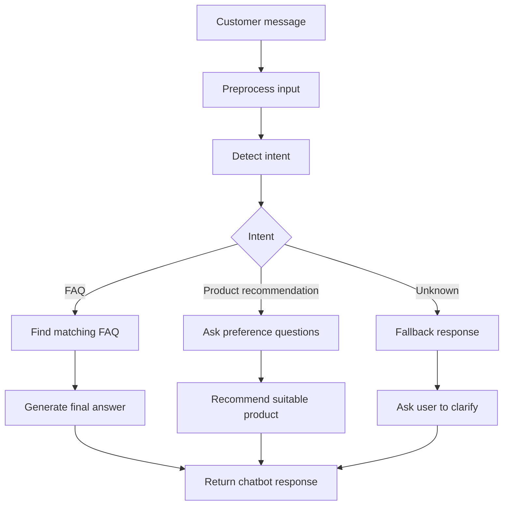

# Chatbot Conversation Flow

## Flow Explanation

1. The customer sends a message.
2. The chatbot normalizes the message.
3. The chatbot detects a simple intent.
4. The chatbot selects the correct FAQ answer or recommendation flow.
5. The chatbot returns a clear response.
